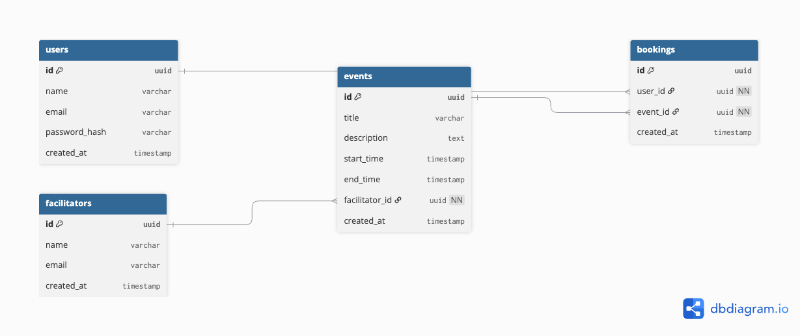

# 🧘 Ahoum Booking System – Backend API

Backend developer assignment for Ahoum Internship Bootcamp.  
This is a RESTful Flask API for booking sessions & retreats, with:

- JWT-based user authentication
- Event/session listing
- Booking system
- CRM notification via webhook
- PostgreSQL (via Supabase)
- Deployed on Render

---

## 🛠️ Tech Stack

- **Flask** – Lightweight REST API framework
- **SQLAlchemy** – ORM for PostgreSQL
- **PostgreSQL** – Supabase-hosted database
- **JWT** – Secure token-based auth (via `Flask-JWT-Extended`)
- **Gunicorn** – WSGI production server for deployment

---

## 🚀 Features

- ✅ User Registration & Login
- ✅ Browse available events/sessions
- ✅ Book events
- ✅ View past & upcoming bookings
- ✅ Notify CRM on booking
- ✅ RESTful API with Postman support

---

## 🗃️ Database Schema



---

## ⚙️ Local Setup

### 1. Clone the Repository

```bash
git clone https://github.com/shashipreetham-4/ahoumAI-backend.git
cd ahoum-backend
```

### 2. Create `.env` File

At the root of your project (`/ahoum-backend/`), create a `.env` file with the following content:

```env
DATABASE_URL=your full Supabase URI (URL-encoded password)
JWT_SECRET_KEY=your_super_secure_secret_key
```

> ✅ **Tips**:
>
> - If your password includes special characters like `@`, use **URL-encoded values** (`@` → `%40`)
> - Never commit `.env` to Git — add it to `.gitignore`

### 3. Set Up Virtual Environment

```bash
python -m venv .venv
source .venv/bin/activate        # Windows: .venv\Scripts\activate
pip install -r requirements.txt
```

### 4. Run the App

```bash
python run.py
```

Visit: [http://localhost:5000](http://localhost:5000)

---

## 📘 API Documentation

> You can also import the full request flow via:  
> 🧾 `Ahoum API.postman_collection.json`

---

### 🔐 Authentication

#### POST `/auth/register`

```json
{
  "name": "Shashi",
  "email": "shashi@example.com",
  "password": "secret"
}
```

#### POST `/auth/login`

```json
{
  "email": "shashi@example.com",
  "password": "secret"
}
```

Returns:

```json
{
  "access_token": "<JWT_TOKEN>"
}
```

---

### 📅 Events

#### GET `/events/`

Returns a list of events/sessions.

No auth required.

---

### 📘 Bookings

#### POST `/bookings/`

**Headers**:

```
Authorization: Bearer <access_token>
Content-Type: application/json
```

**Body**:

```json
{
  "event_id": "<event_id>"
}
```

#### GET `/bookings/mine`

**Headers**:

```
Authorization: Bearer <access_token>
```

Returns the user’s past and upcoming bookings.

---

##  Deployment Instructions on Render

Your API is live at:  
🔗 [https://ahoumai-backend.onrender.com](https://ahoumai-backend.onrender.com)

---

###  Steps to Deploy on Render

1. **Push to GitHub**

   Make sure your code is pushed to GitHub.

2. **Create a Web Service**

   - Go to [https://render.com](https://render.com)
   - Click on **"New Web Service"**
   - Select **"Deploy from a Git repository"**
   - Connect your GitHub and select the correct repository

3. **Set Runtime and Region**

   - Choose Runtime: **Python**
   - Region: **Singapore (Southeast Asia)** (or your preferred)

4. **Environment Variables**

   Add these inside the “Environment” tab:

   | Key              | Value (from your `.env`)                      |
   |------------------|-----------------------------------------------|
   | `DATABASE_URL`   | your full Supabase DB URI (URL-encoded)       |
   | `JWT_SECRET_KEY` | your secret key                               |
   | `PYTHON_VERSION` | `3.11.9`                                       |

   >   Use `PYTHON_VERSION` to avoid psycopg2 errors with Python 3.13.

5. **Build and Start Commands**

   - **Build Command**:
     ```bash
     pip install -r requirements.txt
     ```
   - **Start Command**:
     ```bash
     gunicorn run:app
     ```

6. **Clear Build Cache**

   - Go to Settings → Click **"Clear build cache"**  
   - Then click **Manual Deploy → Deploy latest commit**

---

🎯 Once deployed, you’ll see:
    ```
    https://your-app-name.onrender.com
    ```

---

## 📦 Postman Collection

You can import the included `Ahoum API.postman_collection.json` to test all routes.

Suggested order:

1. `POST /auth/register`
2. `POST /auth/login`
3. Use JWT token in headers (`Bearer <token>`)
4. `GET /events/`
5. `POST /bookings/` with `event_id`
6. `GET /bookings/mine`

---

---

## 💳 Payment Integration Roadmap (Razorpay)

To enable paid bookings for events and sessions, the following steps can be implemented:

1. **Create Razorpay Account**

   - Sign up at [https://razorpay.com](https://razorpay.com) and generate API keys.

2. **Add PaymentIntent Model**

   - Create a `payments` table to log attempts:
     ```python
     class Payment(db.Model):
         id = db.Column(db.String, primary_key=True)
         user_id = db.Column(db.ForeignKey('user.id'), nullable=False)
         event_id = db.Column(db.ForeignKey('event.id'), nullable=False)
         amount = db.Column(db.Integer, nullable=False)
         status = db.Column(db.String, default="created")
         created_at = db.Column(db.DateTime, default=datetime.utcnow)
     ```

3. **Create Checkout Endpoint**

   - Add `/payments/create` endpoint:
     - Accept `event_id`
     - Use Razorpay Python SDK to create payment order
     - Return `order_id`, `amount`, and Razorpay key to frontend

4. **Frontend Integration (Optional)**

   - Use Razorpay Checkout UI or embed payment widget in frontend
   - Pass order details and handle success callback

5. **Verify Payment**

   - After payment, call Razorpay to verify signature and update DB
   - Change booking status to "confirmed"

6. **Update Booking Flow**

   - Make sure booking is confirmed **only** if payment is successful

7. **Admin Dashboard (Optional)**
   - View paid/unpaid users, revenue, event-specific payment stats

> 🛠️ Libraries: [`razorpay`](https://pypi.org/project/razorpay/)

Install:

```bash
pip install razorpay
```

---

## 💡 Bonus Ideas

- 🔐 Add email verification
- 💰 Integrate Razorpay for paid sessions
- 📊 Add facilitator dashboards
- 🔄 Add retry logic for failed CRM notifications

---

## 👨‍💻 Developed by

**Shashi Preetham**
Backend Developer Internship Assignment – Ahoum
[LinkedIn](https://linkedin.com/in/shashi-preetham-cholluri-17760825a)
